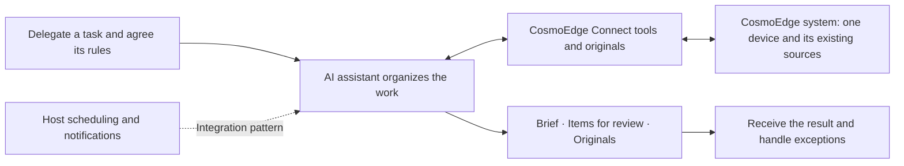

# CosmoEdge Connect

**English** | [简体中文](README.zh-CN.md) · **Alpha · Source preview**

**Delegate routine site operations to your AI assistant.**

CosmoEdge is an open-source edge video AI system. It receives camera video, runs
vision models on edge devices for continuous detection, and provides a visual
interface for configuring tasks, viewing images and managing alarms and events.
Partners can use it to build video analysis applications for stores, warehouses,
campuses and production sites.

Explore the existing system: [CosmoEdge project](https://github.com/cosmo-wander-ai/cosmo-edge) · [Website](https://www.cosmowander.ai/)

**CosmoEdge Connect is the local connector that lets AI assistants use an already
deployed CosmoEdge system.** Reviewing alarms, finding sources, retrieving images
and preparing a handover often mean repeatedly operating the system yourself.
Connect gives the assistant access to existing queries, images and confirmed
changes to detection tasks. Hand over the whole task, receive a useful result with its
source evidence, and focus on judgment, exceptions and on-site follow-up.
Built for teams with a deployed CosmoEdge system and the partners and developers
who turn their working practices into assistant workflows.

> Prepare my shift handover: review yesterday's retained alarms at the back door
> and receiving area, get one image from each of those sources, and use our aisle
> check rules to draft a brief. List anything that needs someone to follow up,
> distinguish uncertain observations, and include the original report and images.

[Explore a workflow](docs/scenarios.md) · [Connect your device](docs/getting-started.md) · [Try without a device](#try-without-a-device)

## Hand over a task and receive a useful result

The assistant can organize the queries and image requests within that task,
then return the brief, supporting originals and follow-up list. You review the
result and deal with missing evidence, unclear observations or a proposed device
change. Source names and rules come from your site. The host assistant assembles
the brief and preliminary review; Connect supplies tool results and originals.


## Three ways to delegate

| Mode | What you delegate | How it fits this release |
| --- | --- | --- |
| **User-triggered delegation** | “Prepare the handover brief for these sources.” | You start the task; the host organizes the queries and image requests and assembles the result. |
| **Host-scheduled checks** | “At the agreed handover time, run this check and send me the brief.” | A capable host starts the task on schedule, coordinates calls and delivers the result. |
| **Preliminary review under agreed rules** | “Review these records and images using our rules, and bring unclear or exceptional cases to me.” | The partner gives the host the review rules and authorized scope; the assistant returns items for a person to handle. |

Configure scheduling, notifications and review rules in the chosen host, then
validate the workflow for your site. This release provides the device tools;
device changes retain local confirmation.

[Follow a complete delegation, from handover brief to exceptions →](docs/scenarios.md)

## How Connect and the assistant share the work

Connect runs on your computer and reaches the CosmoEdge system on one selected
device and its existing sources. Use an AI client that supports local MCP, or the
paired WorkBuddy integration. MCP is the interface a host uses to call tools;
you describe the task in ordinary language.

| Responsibility | Who provides it |
| --- | --- |
| Task scope, review rules and decisions on exceptions | Site staff and their integration partner |
| Planning, model-based review, scheduling, notifications and task policy | The chosen AI host and its configured integration |
| Access to the deployed CosmoEdge system, alarm queries, source images, original retrieval and confirmed operations | CosmoEdge Connect |
| Camera video, visual task configuration and image viewing, continuous detection with edge vision models, and alarm/event management | CosmoEdge system (one device and its existing sources) |



CosmoEdge's edge vision models continuously process video under their configured
tasks, producing detection results and events. The assistant organizes queries,
on-demand image review and material for operational tasks such as handovers,
reviews and maintenance. Partners can first test whether a role's question is
answered usefully, then refine the detection configuration or extend the workflow.

## Turn site knowledge into an ongoing service

Partners can agree the handover format with each role, map everyday source names
to the device catalog, define image-review rules and escalation conditions, and
test whether the resulting brief helps the next shift. Keep those rules and
training examples up to date as people, cameras and working practices change.

See [MCP integration](docs/mcp.md) for the public tools and
[operations](docs/operations.md) for evidence and device-change rules.

## Getting started

**Have a CosmoEdge device?** You need a computer that can reach it, with sources
and algorithms already installed on the device.

1. Follow [installation](docs/installation.md) to build and install the local
   service and paired client.
2. Configure an [MCP client](docs/mcp.md), or import the paired WorkBuddy Skill.
3. Ask the assistant to “Connect to a CosmoEdge device,” then enter the device
   details on the local page it opens.
4. Follow the [quickstart](docs/getting-started.md) for your first query, image
   request and operation.

**Exploring or evaluating?** Read the [workflow example](docs/scenarios.md), or run
the simulation below without a device, credentials or an AI account.

### Try without a device

Run from the repository root with Go 1.25+, Python 3 and `make`. On Windows, use
the direct build commands in [development](docs/development.md) and change the
server path below to `./output/bin/cosmoedge-mcp.exe`.

```sh
make build
go run ./examples/mcp-client --server ./output/bin/cosmoedge-mcp --mock
```

[This example](examples/mcp-client/main.go) calls a local synthetic service through
the real MCP adapter. It retrieves image content and an original report, prepares
and cancels a change, and checks request recovery and context isolation. It does
not call a model, connect to a real device or display an AI client's interface.

Successful JSON output includes these fields (excerpt):

```json
{
  "mock": true,
  "tools": 12,
  "imageContent": true,
  "originalReportResource": true,
  "reviewRequiresUser": true,
  "captureSubmissions": 1,
  "syntheticDeviceWrites": 0
}
```

`imageContent` and `originalReportResource` mean the program received image content
and a report resource. `syntheticDeviceWrites: 0` means this simulation performed
no device writes. For the flow in an actual AI client, follow the
[quickstart](docs/getting-started.md).

## Current release scope

This is an **alpha source preview**, with source code and development-package
tooling. See [compatibility](docs/compatibility.md) for platform checks and package
and client acceptance status.

- **Connection:** one local user, one selected CosmoEdge device and its existing sources.
- **Records and images:** summaries state the retained-record scope actually read. Image questions use a captured still image and the host model, not continuous video reasoning; check interpretations against the site. A new image cannot establish the cause of a past alarm. The host's deployment determines where its model processes images.
- **Device operations:** enable or disable installed algorithms while preserving parameters, regions and schedules. Pausing and resuming each require local confirmation.
- **Host orchestration:** no built-in scheduler or notification service. A capable host can orchestrate scheduled checks and preliminary review, subject to integration validation and the same device-confirmation rules.
- **Outside this release:** multiple devices, remote/cloud MCP, WeChat integration and device changes without local user confirmation.

## Development and integration

Third-party clients should use the public [MCP tool interface](docs/mcp.md).
The optional [operations Skill (Chinese)](skills/cosmoedge-operations/SKILL.md)
provides guidance on dates, sources, follow-up questions and result interpretation;
clients can call the tools without a Skill. WorkBuddy's paired Python client also
uses a `cosmoedge-operations` Skill; install the version for your chosen integration.

The official adapter and service are built as a matched pair. The internal HTTP
API supports the adapter implementation and has no separate long-term compatibility
commitment. The WorkBuddy package also requires Python 3.9+; see
[development](docs/development.md) for other test dependencies.

| Documentation | Contents |
| --- | --- |
| [Workflow examples](docs/scenarios.md) | Delegated handover briefs, host orchestration and handling exceptions |
| [Architecture](docs/architecture.md) | Responsibilities of the service, adapter, Skill and runtime state |
| [Operations](docs/operations.md) | Counting rules, image sources, request recovery and change outcomes |
| [Testing](docs/testing.md) | Automated checks, real-client validation and device acceptance |
| [Troubleshooting](docs/troubleshooting.md) | Connection, image delivery and request-recovery diagnostics |
| [Upgrade and recovery](docs/upgrade.md) | Paired package updates, backups and state recovery |
| [Contributing](CONTRIBUTING.md) | Developing and submitting changes |
| [Security](SECURITY.md) | Local state, credentials and vulnerability reporting |

## License

CosmoEdge Connect is licensed under the [Apache License 2.0](LICENSE).
Third-party components retain their own licenses; see [NOTICE](NOTICE).
