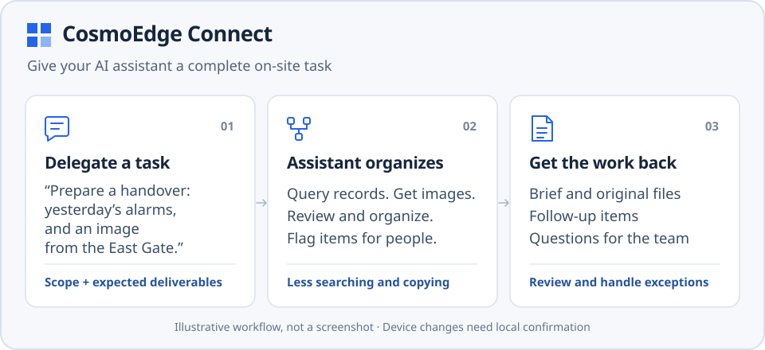
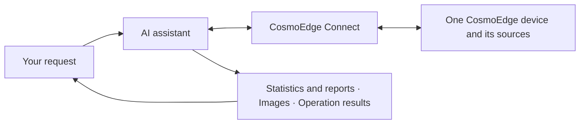

# CosmoEdge Connect

**English** | [简体中文](README.zh-CN.md) · **Alpha · Source preview**

**Give your AI assistant a view of your site, access to its records, and a way to help operate it.**

Connect CosmoEdge alarms, camera images and device operations to the AI assistant
you use. Ask a question, get source evidence, follow up, and confirm a specific
action when needed. Built for teams with an existing CosmoEdge device and for
developers building workflows for them.

[Explore a workflow](docs/scenarios.md) · [Connect your device](docs/getting-started.md) · [Try without a device](#try-without-a-device)



## Connect your AI assistant to your site

CosmoEdge manages site cameras and deployed detection algorithms. Connect runs
on your computer to reach the device, retrieve original material and carry out
operations. Your AI assistant handles the conversation and uses its host model
to interpret the images it receives.



Use an AI client that supports local MCP, or the paired WorkBuddy integration.
MCP is the interface an AI client uses to call tools; you still describe your task
in ordinary language.

## Start with a question from your workday

Site handovers, store checks and factory maintenance all involve finding records,
looking at a scene or adjusting a detection task. Source names below are examples;
use the sources and algorithms already installed on your device.

| When to use it | What to ask | What you get |
| --- | --- | --- |
| **Handovers and operational reviews** | “What alarms were recorded at the east and west gates yesterday? Group them by category and give me the original report.” | Statistics and a report queried by time window, source and algorithm, reducing manual filtering and compilation |
| **An on-demand look at your site** | “Get an image of the loading area. What is stored near the aisle? Give me the original image.” | A source image and the host model's interpretation; “What is on the right in that image?” reuses the same original |
| **Maintenance and device operations** | “Prepare to pause this detection task in the loading area, keeping its settings.” | A specific proposal, local confirmation and a check of device state after execution; resuming requires another request and confirmation |

Combine these steps in one working conversation: review the alarm distribution,
request an image from a selected source, then prepare to pause or resume a task
if the site team has decided to carry out maintenance. Reports and images remain
available for follow-up questions, and changes have an explicit confirmation and
verification step.

[Walk through a complete example: from handover to maintenance →](docs/scenarios.md)

## Combine established detection with questions as they arise

Deployed edge algorithms keep running their configured detection tasks. When
someone has a new question about people, objects or the use of a space, they can
request a still image and discuss it with the host model while keeping the original
in view. This provides a person-initiated way to look into questions that do not
yet have a dedicated detector.

Developers can combine queries, image requests and confirmed operations into their
own handover, review or maintenance workflows. See [MCP integration](docs/mcp.md)
for the public tools and [operations](docs/operations.md) for interpreting results
and handling changes.

## Getting started

**Have a CosmoEdge device?** You need a computer that can reach it, with sources
and algorithms already installed on the device.

1. Follow [installation](docs/installation.md) to build and install the local
   service and paired client.
2. Enter the device details and connect through the CosmoEdge Connect local page.
3. Configure an [MCP client](docs/mcp.md), or import the paired WorkBuddy Skill.
4. Follow the [quickstart](docs/getting-started.md) for your first query, image
   request and operation.

**Exploring or evaluating?** Read the [workflow example](docs/scenarios.md), or run
the simulation below without a device, credentials or an AI account.

### Try without a device

Run from the repository root with Go 1.25+, Python 3 and `make`. On Windows, use
the direct build commands in [development](docs/development.md) and change the
server path below to `./output/bin/cosmoedge-mcp.exe`.

```sh
make build
go run ./examples/mcp-client --server ./output/bin/cosmoedge-mcp --mock
```

[This example](examples/mcp-client/main.go) calls a local synthetic service through
the real MCP adapter. It retrieves image content and an original report, prepares
and cancels a change, and checks request recovery and context isolation. It does
not call a model, connect to a real device or display an AI client's interface.

Successful JSON output includes these fields (excerpt):

```json
{
  "mock": true,
  "tools": 12,
  "imageContent": true,
  "originalReportResource": true,
  "reviewRequiresUser": true,
  "captureSubmissions": 1,
  "syntheticDeviceWrites": 0
}
```

`imageContent` and `originalReportResource` mean the program received image content
and a report resource. `syntheticDeviceWrites: 0` means this simulation performed
no device writes. For the flow in an actual AI client, follow the
[quickstart](docs/getting-started.md).

## Current release scope

This is an **alpha source preview**, with source code and development-package
tooling. See [compatibility](docs/compatibility.md) for platform checks and package
and client acceptance status.

- **Connection:** one local user, one selected CosmoEdge device and its existing sources.
- **Records and images:** summaries state the retained-record scope actually read. Image questions use one captured image and the host model; check interpretations against the site. A new image cannot establish the cause of a past alarm.
- **Device operations:** enable or disable installed algorithms while preserving parameters, regions and schedules. Pausing and resuming each require local confirmation.
- **Not yet supported:** multiple devices, remote/cloud MCP, WeChat, scheduled inspections or autonomous action without user confirmation.

## Development and integration

Third-party clients should use the public [MCP tool interface](docs/mcp.md).
The optional [operations Skill (Chinese)](skills/cosmoedge-operations/SKILL.md)
provides guidance on dates, sources, follow-up questions and result interpretation;
clients can call the tools without a Skill. WorkBuddy's paired Python client also
uses a `cosmoedge-operations` Skill; install the version for your chosen integration.

The official adapter and service are built as a matched pair. The internal HTTP
API supports the adapter implementation and has no separate long-term compatibility
commitment. The WorkBuddy package also requires Python 3.9+; see
[development](docs/development.md) for other test dependencies.

| Documentation | Contents |
| --- | --- |
| [Workflow examples](docs/scenarios.md) | A sequence of handover, image review and maintenance tasks |
| [Architecture](docs/architecture.md) | Responsibilities of the service, adapter, Skill and runtime state |
| [Operations](docs/operations.md) | Counting rules, image sources, request recovery and change outcomes |
| [Testing](docs/testing.md) | Automated checks, real-client validation and device acceptance |
| [Troubleshooting](docs/troubleshooting.md) | Connection, image delivery and request-recovery diagnostics |
| [Upgrade and recovery](docs/upgrade.md) | Paired package updates, backups and state recovery |
| [Contributing](CONTRIBUTING.md) | Developing and submitting changes |
| [Security](SECURITY.md) | Local state, credentials and vulnerability reporting |

## License

CosmoEdge Connect is licensed under the [Apache License 2.0](LICENSE).
Third-party components retain their own licenses; see [NOTICE](NOTICE).
