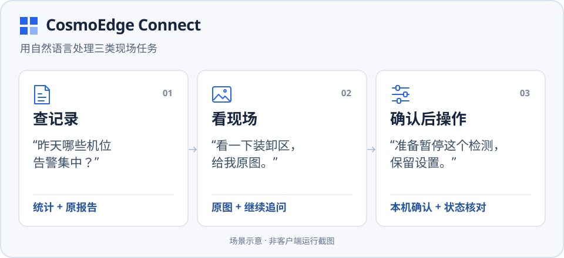
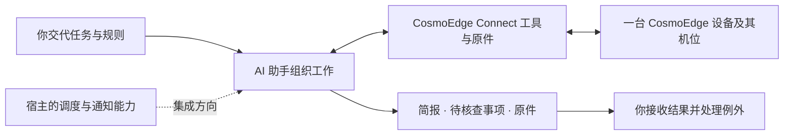

# CosmoEdge Connect

[English](README.md) | **简体中文** · **Alpha · 源码预览**

**把繁琐的现场运营工作交给 AI 助手。**

查告警、找机位、取画面、整理交班材料，往往需要人反复操作现场系统。
CosmoEdge Connect 把这些设备能力接入 AI 助手，让助手围绕你交代的任务组织步骤、
收集资料并交回结果。你可以把时间用在判断结果、处理例外和安排现场跟进上。

> 帮我准备交班简报：查昨天后门和收货区的留存告警，分别取这两个机位的一张图，
> 重点看通道里的可见物品，列出需要人工跟进的事项，附上原报告和原图。

适合已有 CosmoEdge 设备的现场团队，以及为他们设计业务流程的方案伙伴与开发者。

[阅读任务示例](docs/scenarios.zh-CN.md) · [连接你的设备](docs/getting-started.zh-CN.md) · [无需设备试运行](#无需设备试运行)

## 交代一项任务，收到可继续工作的结果

以交班为例，助手先查询指定日期和机位的记录，再取得指定机位的图像，
结合你提供的岗位规则整理初步简报。交回的内容可以包括告警分布、图中可见情况、
需要人工核查的事项，以及对应的原报告和原图。

记录没有读全、机位无法取图、图中看不清的地方，也应一并带回来。
你据此安排跟进，需要时继续围绕同一份报告或原图追问。
简报的组织和初步判断由宿主助手完成，Connect 提供设备工具、执行结果与原件。



下面是三种组织工作的方式，可用于门店、园区、仓储或生产现场：

| 工作方式 | 可以交代的任务 | 如何组织 |
| --- | --- | --- |
| **按指令代办** | “准备这次交班简报，查记录、取指定机位的图，把待核查事项和原件给我。” | 你发起任务，宿主调用 Connect 工具完成查询和取图，并整理结果 |
| **按计划检查** | “每天交班前检查指定机位，把结果和未完成项通知我。” | 具备调度能力的宿主按计划发起任务，组织调用并发送通知 |
| **按业务规则初步复核** | “按我们的通道核查规则检查这些资料，把疑似问题和无法判断的地方交给值班员。” | 伙伴把规则和授权范围交给宿主，由助手做初步筛查并交回需要人处理的事项 |

按计划检查和规则复核是宿主集成方向，需要在所选宿主上配置、验证相应流程。
本版提供其中的设备工具基础；现有设备变更仍逐次由人在本机页面确认。

[查看完整场景：委托、执行、交回结果与处理例外 →](docs/scenarios.zh-CN.md)

## Connect 和 AI 助手怎样分工

Connect 运行在你的电脑上，连接一台选定的 CosmoEdge 设备。
你可以使用支持本地 MCP 的 AI 客户端，或配套的 WorkBuddy 集成。
MCP 是宿主调用工具的接口，你仍然用自然语言交代工作。

| 参与者 | 负责什么 |
| --- | --- |
| **现场人员** | 交代目标与规则、接收结果、处理例外，并确认具体设备变更 |
| **AI 助手及其宿主** | 理解任务、组织工具调用、用模型分析图像、整理结果；具备相应能力时承担调度、通知和授权规则管理 |
| **CosmoEdge Connect** | 连接设备，提供查询、取图和经确认的启停工具，返回执行结果及原报告、原图 |
| **CosmoEdge 边缘设备** | 管理已有机位与算法，持续运行已部署的检测，并提供留存记录与图像 |



已有边缘检测与助手按需看图可以配合：前者持续执行既定检测，
后者围绕工作中的临时问题查看图像。伙伴可以先验证一个岗位问题是否得到帮助，
再决定是否将它做成固定检测或更完整的工作流程。

## 伙伴可以交付什么

把现场经验整理成助手可执行的任务，是集成工作的重要部分。例如：

- 对齐机位名称与客户常用说法，让“后门”“收货区”对应到正确对象。
- 为交班、核查、检修等岗位准备完整任务模板，约定需要交回哪些结果和原件。
- 明确初步复核规则、需要到场检查的情况，以及何时请人继续处理。
- 选择并配置宿主，完成流程验证、人员培训，并在机位或业务变化后复测。

这些内容可以随客户的实际使用逐步完善。先从一个岗位、一台设备和一项重复工作开始。
公开能力见 [MCP 接入](docs/mcp.zh-CN.md)，结果解释与操作约定见[业务约定（英文）](docs/operations.md)。

## 开始使用

**已有 CosmoEdge 设备：** 准备一台能访问设备的电脑，以及设备上已有的机位与算法。

1. 按[安装说明](docs/installation.zh-CN.md)构建并安装本地服务及配套客户端。
2. 配置 [MCP 客户端](docs/mcp.zh-CN.md)，或导入配套的 WorkBuddy Skill。
3. 在对话中让助手“连接 CosmoEdge 设备”，在打开的本机页面填写设备信息并连接。
4. 按[快速上手](docs/getting-started.zh-CN.md)完成首次查询、看图和操作。

**先了解或评估：** 阅读[任务委托示例](docs/scenarios.zh-CN.md)，
或运行下面的模拟程序，无需设备、凭据或 AI 账号。

### 无需设备试运行

在仓库根目录运行，需 Go 1.25+、Python 3 和 `make`。
Windows 可使用[开发指南（英文）](docs/development.md)中的直接构建命令，
并将下方服务端路径改为 `./output/bin/cosmoedge-mcp.exe`。

```sh
make build
go run ./examples/mcp-client --server ./output/bin/cosmoedge-mcp --mock
```

[这个示例](examples/mcp-client/main.go)通过真实 MCP 适配器调用本地模拟服务：
取得图像内容和原报告，准备一项变更后取消，并检查请求恢复及上下文隔离。
它不调用大模型、不连接真实设备，也不展示 AI 客户端界面。

成功时输出的 JSON 包含以下字段（节选）：

```json
{
  "mock": true,
  "tools": 12,
  "imageContent": true,
  "originalReportResource": true,
  "reviewRequiresUser": true,
  "captureSubmissions": 1,
  "syntheticDeviceWrites": 0
}
```

其中 `imageContent` 和 `originalReportResource` 表示程序实际取得了图像内容和报告资源；
`syntheticDeviceWrites: 0` 表示本次模拟没有执行设备写入。
接入实际 AI 客户端后的流程见[快速上手](docs/getting-started.zh-CN.md)。

## 当前版本的范围

这是 **Alpha 源码预览版**，提供源码与开发包构建方式。
各平台的检查项目、安装包和客户端验收状态见[兼容性（英文）](docs/compatibility.md)。

- **连接范围：** 一个本地用户、一台选定的 CosmoEdge 设备及其已有机位。
- **记录与图像：** 统计覆盖实际读到的留存记录；看图采用单次取图与宿主模型分析，结论需结合现场核实。本次取得的画面不能用于证明历史告警的原因。
- **设备操作：** 启停已安装算法，保留原参数、区域和计划；暂停与恢复都各自需要本机确认。
- **宿主集成：** 本版不内置调度器。按计划检查、通知和业务复核流程由宿主配置并验证，尚未作为成套方案交付；当前也不提供多设备、远程云端 MCP 或微信接入。

## 开发与集成

第三方客户端优先使用公开的 [MCP 工具接口](docs/mcp.zh-CN.md)。可选的
[官方运营 Skill](skills/cosmoedge-operations/SKILL.md)提供日期、机位、追问和
结果解释指导；不安装 Skill 也能调用工具。WorkBuddy 的配套 Python 客户端也使用
`cosmoedge-operations` Skill；按所选接入方式安装对应版本。

官方适配器和服务配套构建；内部 HTTP 接口用于适配器实现，不作为独立的长期兼容承诺。
WorkBuddy 包另需 Python 3.9+；测试环境的其他依赖见[开发指南（英文）](docs/development.md)。

| 文档 | 内容 |
| --- | --- |
| [场景示例](docs/scenarios.zh-CN.md) | 完整交班委托、宿主计划检查与检修协作 |
| [架构（英文）](docs/architecture.md) | 服务、适配器、Skill 和运行状态的职责 |
| [业务约定（英文）](docs/operations.md) | 统计口径、图像来源、请求恢复和变更结果 |
| [测试（英文）](docs/testing.md) | 自动检查、真实客户端与设备验收 |
| [排障（英文）](docs/troubleshooting.md) | 连接、图片交付及请求恢复问题的诊断 |
| [升级与恢复（英文）](docs/upgrade.md) | 配套包更新、备份和状态恢复 |
| [贡献（英文）](CONTRIBUTING.md) | 开发和提交变更 |
| [安全（英文）](SECURITY.md) | 本地状态、凭据及漏洞报告 |

## 许可证

CosmoEdge Connect 采用 [Apache License 2.0](LICENSE)。第三方组件保留各自许可证，
见 [NOTICE](NOTICE)。
