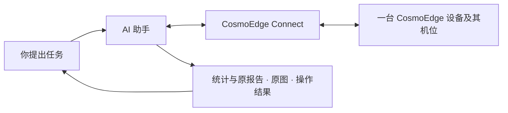

# CosmoEdge Connect

[English](README.md) | **简体中文** · **Alpha · 源码预览**

**让 AI 助手看见现场、查阅记录，并协助你操作设备。**

把 CosmoEdge 的告警、机位画面和设备操作接入你使用的 AI 助手。
用自然语言提出问题，取得现场证据，继续追问，并在确认后完成具体操作。
适合已有 CosmoEdge 设备的现场团队，以及为他们构建业务流程的开发者。

[阅读场景示例](docs/scenarios.zh-CN.md) · [连接你的设备](docs/getting-started.zh-CN.md) · [无需设备试运行](#无需设备试运行)


## 把 AI 助手连接到现场

CosmoEdge 管理现场机位与已部署的检测算法。Connect 运行在你的电脑上，
负责连接设备、取得原始资料和执行操作；AI 助手负责对话，并用宿主模型理解取得的图像。



你可以使用支持本地 MCP 的 AI 客户端，或配套的 WorkBuddy 集成。
MCP 是 AI 客户端调用工具的接口；你在对话中仍然用自然语言提出任务。

## 从日常工作中的一个问题开始

园区交班、门店查看现场、工厂检修，都有查询记录、核对画面和调整检测任务的需要。
下面的机位名称是示例，使用时选择自己设备上的已有机位与算法。

| 工作场景 | 可以怎样问 | 得到什么 |
| --- | --- | --- |
| **交班与运营复盘** | “昨天东门和西门分别有哪些告警？按类别整理，给我原报告。” | 按时间范围、机位和算法查询的统计与报告，减少逐页筛选和手工汇总 |
| **按需查看现场** | “取一下装卸区的画面，看看通道附近堆了什么，把原图给我。” | 一张机位原图与宿主模型的分析；继续问“就这张图，右侧是什么”时沿用同一原图 |
| **检修与设备协作** | “准备暂停装卸区的这项检测，保留原设置。” | 明确的变更提议、本机确认和执行后的状态核对；恢复时再次提出并确认操作 |

这些能力可以接成一次协作：先了解告警分布，再按需看看指定机位；
如果现场已经决定检修，就准备相应任务的暂停与恢复。
报告和图像可供后续追问，操作有明确的确认步骤和核对结果。

[查看完整场景：从交班复盘到检修协作 →](docs/scenarios.zh-CN.md)

## 已有检测与临时问题，可以配合使用

已部署的边缘算法持续执行既定检测。业务人员临时想了解人员、物品或空间状态时，
可以按需取得一张图，让宿主模型围绕具体问题分析，保留原图一起讨论。
这为尚未配置专用检测的问题提供了一个人工发起的查看入口。

开发者可以将查询、取图和经确认的操作组合进自己的交班、复盘或检修流程。
公开能力见 [MCP 接入](docs/mcp.zh-CN.md)，结果解释与操作约定见[业务约定（英文）](docs/operations.md)。

## 开始使用

**已有 CosmoEdge 设备：** 准备一台能访问设备的电脑，以及设备上已有的机位与算法。

1. 按[安装说明](docs/installation.zh-CN.md)构建并安装本地服务及配套客户端。
2. 在 CosmoEdge Connect 本机页面填写设备信息并连接。
3. 配置 [MCP 客户端](docs/mcp.zh-CN.md)，或导入配套的 WorkBuddy Skill。
4. 按[快速上手](docs/getting-started.zh-CN.md)完成首次查询、看图和操作。

**先了解或评估：** 阅读[连续场景示例](docs/scenarios.zh-CN.md)，
或运行下面的模拟程序，无需设备、凭据或 AI 账号。

### 无需设备试运行

在仓库根目录运行，需 Go 1.25+、Python 3 和 `make`。
Windows 可使用[开发指南（英文）](docs/development.md)中的直接构建命令，
并将下方服务端路径改为 `./output/bin/cosmoedge-mcp.exe`。

```sh
make build
go run ./examples/mcp-client --server ./output/bin/cosmoedge-mcp --mock
```

[这个示例](examples/mcp-client/main.go)通过真实 MCP 适配器调用本地模拟服务：
取得图像内容和原报告，准备一项变更后取消，并检查请求恢复及上下文隔离。
它不调用大模型、不连接真实设备，也不展示 AI 客户端界面。

成功时输出的 JSON 包含以下字段（节选）：

```json
{
  "mock": true,
  "tools": 12,
  "imageContent": true,
  "originalReportResource": true,
  "reviewRequiresUser": true,
  "captureSubmissions": 1,
  "syntheticDeviceWrites": 0
}
```

其中 `imageContent` 和 `originalReportResource` 表示程序实际取得了图像内容和报告资源；
`syntheticDeviceWrites: 0` 表示本次模拟没有执行设备写入。
接入实际 AI 客户端后的流程见[快速上手](docs/getting-started.zh-CN.md)。

## 当前版本的范围

这是 **Alpha 源码预览版**，提供源码与开发包构建方式。
各平台的检查项目、安装包和客户端验收状态见[兼容性（英文）](docs/compatibility.md)。

- **连接范围：** 一个本地用户、一台选定的 CosmoEdge 设备及其已有机位。
- **记录与图像：** 统计说明实际读到的留存记录范围；看图是单次取图、宿主模型分析，判断需结合现场核实。当前画面不能用于证明历史告警的原因。
- **设备操作：** 启停已安装算法，保留原参数、区域和计划；暂停与恢复都各自需要本机确认。
- **尚未支持：** 多设备、远程云端 MCP、微信、定时巡检和无人确认的自主处置。

## 开发与集成

第三方客户端优先使用公开的 [MCP 工具接口](docs/mcp.zh-CN.md)。可选的
[官方运营 Skill](skills/cosmoedge-operations/SKILL.md)提供日期、机位、追问和
结果解释指导；不安装 Skill 也能调用工具。WorkBuddy 的配套 Python 客户端也使用
`cosmoedge-operations` Skill；按所选接入方式安装对应版本。

官方适配器和服务配套构建；内部 HTTP 接口用于适配器实现，不作为独立的长期兼容承诺。
WorkBuddy 包另需 Python 3.9+；测试环境的其他依赖见[开发指南（英文）](docs/development.md)。

| 文档 | 内容 |
| --- | --- |
| [场景示例](docs/scenarios.zh-CN.md) | 交班复盘、按需看图和检修协作的连续任务 |
| [架构（英文）](docs/architecture.md) | 服务、适配器、Skill 和运行状态的职责 |
| [业务约定（英文）](docs/operations.md) | 统计口径、图像来源、请求恢复和变更结果 |
| [测试（英文）](docs/testing.md) | 自动检查、真实客户端与设备验收 |
| [排障（英文）](docs/troubleshooting.md) | 连接、图片交付及请求恢复问题的诊断 |
| [升级与恢复（英文）](docs/upgrade.md) | 配套包更新、备份和状态恢复 |
| [贡献（英文）](CONTRIBUTING.md) | 开发和提交变更 |
| [安全（英文）](SECURITY.md) | 本地状态、凭据及漏洞报告 |

## 许可证

CosmoEdge Connect 采用 [Apache License 2.0](LICENSE)。第三方组件保留各自许可证，
见 [NOTICE](NOTICE)。
